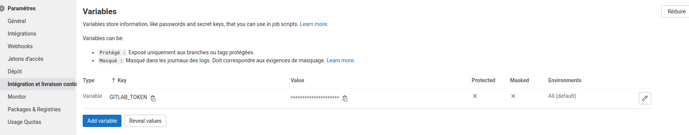

# Configuration Semantic release
## Setup du projet

Sur le projet Gitlab il faut ajouter une variable de CI avec comme Key `GITLAB_TOKEN` et value une clé API.
La clé API est géré dans [personal access token](https://docs.gitlab.com/ce/user/profile/personal_access_tokens.html) et bien choisir les scope `api` et `write_repository`.

Cette clé API pourra être réutilisé pour créer des variables de CI sur d'autres projets.

## Configuration

La configuration se situe dans le fichier `.releaserc` à la racine du projet.

## Lancement

La tâche release est disponible en dernière étape dans les pipelines qui concernent des branches et non des tags.
